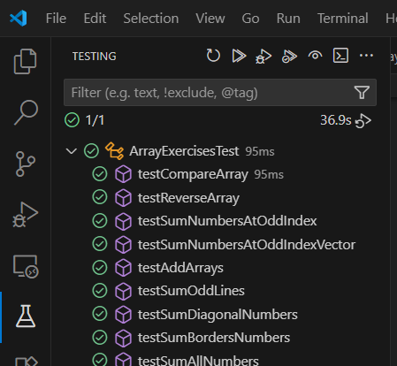

# Katas PHP

Vous retrouverez dans ce dépôt des exercices de développement PHP basé sur une approche "TDD" (Test Driven Development).

Compétences abordées :
- développement d'algorithmes
- implémentation en PHP
- tests unitaires

## Contenu du dépôt

Ce projet est divisé en plusieurs fichiers PHP à compléter, tous contenus dans le sous-dossier `src` :
1. `BasicsExercises.php` : prise en main du langage
2. `LoopExercises.php` : entraînement à l'utilisation de boucles
3. `ArrayExercises.php` : entraînement à la manipulation de tableaux
4. `StringExercises.php` : entraînement à la manipulation de chaînes de caractères

Pour chacun de ces fichier, un fichier de test est fourni.
Il vous faudra compléter les fonctions proposées dans les fichiers suffixés par `Exercises` pour que les tests fonctionnent.

## Mise en place de l'environnement de développement

### Gestionnaire de dépendances composer

Le projet est basé sur l'utilisation de la bibliothèque `PHPUnit` utilisée pour mettre en place des tests unitaires.

L'outil `composer` est utilisé en tant que gestionnaire de dépendances de ce projet.

Il vous faudra veiller à bien installer `composer`, en cas de besoin vous trouverez un procédure d'installation à [l'adresse suivante](https://github.com/ludovic-esperce/php-dev-env?tab=readme-ov-file#%C3%A9tape-3--installation-de-composer).

Afin de tester si composer est correctement installé vous pourrez faire la commande suivante :
```sh
composer --version
```

### Configuration de PHP

Afin de pouvoir lancer les tests il faut une installation de PHP fonctionnelle avec les extensions suivantes :
- ext-dom
- ext-json
- ext-libxml
- ext-mbstring
- ext-xml
- ext-xmlwriter

Normalement il ne vous faudra activer que l'extension `mbstring`. Faites le uniquement en cas d'erreur lors du lancement d'un test.

S'il vous faut activer une extension, vous pourrez suivre la documentation [disponible ici](https://www.php.net/manual/en/install.pecl.windows.php#install.pecl.windows.loading).

### Installation d'extension VSCode

Plusieurs extensions VSCode vous permettent d'obtenir une interface graphique simple lancer les tests unitaires.

Vous pourrez, par exemple, utiliser [celle-ci](https://marketplace.visualstudio.com/items?itemName=recca0120.vscode-phpunit).

Ceci vous permettra d'accéder au menu de test comme présenté par l'image ci-dessous :

.

## Marche à suivre 

Prenez connaissance des fonctions à compléter dans l'ordre suivant :
1. `BasicsExercises.php` : prise en main du langage
2. `LoopExercises.php` : entraînement à l'utilisation de boucles
3. `ArrayExercises.php` : entraînement à la manipulation de tableaux
4. `StringExercises.php` : entraînement à la manipulation de chaînes de caractères

Pour chacune des fonctions l'objectif est de satisfaire le test untiaire associé.